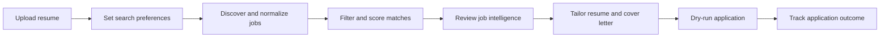

# TailoredResume

TailoredResume is an AI-assisted career workspace that discovers jobs, scores them against a candidate profile, prepares tailored application materials, and tracks progress from saved job to interview.

The project currently targets local development and limited beta use. Automated applications run in dry-run mode by default so a user can review the completed form before submission.

## Core workflow



## Features

- Resume ingestion from PDF, DOCX, Markdown, or plain text
- Prompt-driven job search preferences
- Multi-source job discovery and normalization
- Candidate-specific fit scoring and skill-gap analysis
- Tailored resumes and cover letters
- Company, salary, roadmap, and interview-preparation panels
- Application Kanban and background task tracking
- Dry-run browser automation for supported application flows

## Architecture

| Area | Technology | Purpose |
| --- | --- | --- |
| Web application | Next.js 16, React 19, TypeScript | Dashboard and application review experience |
| API | FastAPI | Authenticated product API |
| Background work | Celery and Redis | Discovery, enrichment, tailoring, and application jobs |
| Persistence | SQLite in WAL mode | Jobs, resumes, configuration, and task state |
| AI | LiteLLM, Instructor, Gemini-compatible models | Structured scoring and content generation |
| Browser automation | Playwright | Dry-run and supported application workflows |
| Authentication | Clerk | User identity and API bearer tokens |

The API, worker, and scheduler share the same SQLite file. Docker Compose persists this file in the `sqlite_data` volume.

## Prerequisites

- Python 3.11 or 3.12
- Node.js 20 or later
- Redis 7 or later, or Docker Desktop
- An LLM API key for AI-powered features
- Optional Clerk credentials for authenticated multi-user mode

## Quick start with Docker

1. Copy `.env.example` to `.env` and set at least `GEMINI_API_KEY`.
2. If using Clerk, also configure the Clerk backend and frontend variables described below.
3. Start the stack:

   ```powershell
   docker compose up --build
   ```

4. Open `http://localhost:3000`.

The stack exposes the frontend on port `3000`, the API on `8001`, and Redis on `6379`.

## Local development

### 1. Install the backend

From the project root:

```powershell
py -3.12 -m venv .venv
.venv\Scripts\Activate.ps1
python -m pip install --upgrade pip
python -m pip install -r requirements.txt
python -m playwright install chromium
```

Copy the environment template:

```powershell
Copy-Item .env.example .env
```

At minimum, replace `GEMINI_API_KEY`. `SQLITE_DB_PATH` is optional and defaults to `app.db` in the project root.

### 2. Start Redis

```powershell
docker compose up -d redis
```

### 3. Start the backend processes

Use separate terminals from the project root:

```powershell
python main.py api
```

```powershell
celery -A app.celery_app worker --loglevel=info -P solo
```

```powershell
celery -A app.celery_app beat --loglevel=info
```

The `-P solo` worker option is recommended on Windows. On Linux and macOS, the standard Celery worker pool can be used.

### 4. Start the frontend

```powershell
Set-Location web
npm ci
npm run dev
```

Open `http://localhost:3000`.

## Authentication configuration

The backend reads these values from the root `.env`:

```text
CLERK_JWKS_URL=https://<your-instance>.clerk.accounts.dev/.well-known/jwks.json
CLERK_SECRET_KEY=sk_test_...
```

The frontend reads these values from `web/.env.local`:

```text
NEXT_PUBLIC_CLERK_PUBLISHABLE_KEY=pk_test_...
CLERK_SECRET_KEY=sk_test_...
NEXT_PUBLIC_API_URL=http://localhost:8001
```

When Clerk is not configured, the current beta falls back to a shared `guest_user` for local testing. Do not expose guest mode to untrusted users or use it as a production authentication strategy.

## Commands

### Backend

```powershell
python main.py init
python main.py run <user_id>
python main.py api
python main.py reset-db
python -m pytest tests
```

`reset-db` deletes the local SQLite database. Use it only when you intentionally want to remove local application data.

### Frontend

Run these commands from `web/`:

```powershell
npm run dev
npm run lint
npm run typecheck
npm run build
npm run verify
```

### Evaluation and metrics

```powershell
python scripts/run_evals.py
python scripts/source_metrics.py <user_id>
python scripts/export_to_eval.py <user_id> [limit]
```

## Environment variables

The full template is in `.env.example`. Important groups include:

- AI: `GEMINI_API_KEY`, `GEMINI_MODEL`, `JSEARCH_API_KEY`
- Storage: `SQLITE_DB_PATH`, optional Supabase settings
- Authentication: Clerk JWKS and secret keys
- Background work: `REDIS_URL`
- Encryption: `ENCRYPTION_MASTER_KEY`
- Reliability: retry, timeout, batching, and throttling settings

Never commit `.env`, `web/.env.local`, database files, WAL files, screenshots containing applicant data, or Celery schedule files.

## Verification

Phase 1 establishes these required release checks:

- Backend tests pass.
- Frontend lint has no errors or warnings.
- TypeScript strict checking passes.
- The optimized Next.js production build completes.
- Docker Compose configuration is valid.

The same checks run automatically in `.github/workflows/ci.yml`.

## Current limitations

- Critical backend paths still need broader integration and end-to-end coverage.
- Discovery funnel counts in the current dashboard are partly estimated and should not be treated as audited analytics.
- Guest authentication is intended only for local development.
- Live application submission requires careful review and production hardening; dry-run mode is the safe default.
- SQLite is suitable for local and limited beta use, but database strategy should be revisited before high-concurrency deployment.

## Repository layout

```text
app/                 FastAPI, discovery, scoring, tailoring, and task code
app/strategies/      Job-source strategies
app/services/        Domain services such as resume storage
config/              Search and source configuration
scripts/             Evaluation, migration, and metrics utilities
tests/               Backend unit tests
web/                 Next.js frontend
alembic/             Historical relational database migrations
supabase/            Supabase-specific migrations
```

## Safety principles

- Preserve the original resume and make generated changes reviewable.
- Never invent candidate experience or achievements.
- Keep application submission human-approved by default.
- Scope all user data access to the authenticated user.
- Prefer measured product data over estimated metrics.
